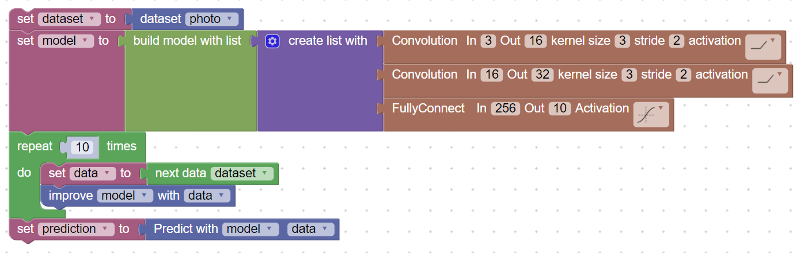

# MindTorch:

Minetorch is a blockyly programming platform for children to learn and integrate deep learning models into their projects

This platform allows children to use build structure of deep learning pipeline which can be vizulized and easy to understand

## Machine Learning model Creation:

MineTorch allows us to use Machine Learning components in the form of blocks.

### How to Add Dataset Block?:

We can use datasets containing Numeric and Image data using Dataset block.


### How to Build Model Architecture?:

Deep learning model is made of Multiple layers like Dense Layer, Convolution Layer, Activation Function etc. We have separate block for each of such components. The block associated with such layers allows us to choose hyper parameters of model using dropdown in the block.  

We can combine each layer in sequence and create a complete model architecture using blocks.


As shown in above demo, we will also get pytorch model code in python. Here is generated Python code for above demo,

```python
model = None

model = nn.Sequential(*[nn.Conv2d(3, 36, 3, 1, 1), nn.Tanh(), nn.Conv2d(36, 64, 3, 1, 1), nn.Tanh(), nn.Conv2d(64, 128, 3, 1, 1), nn.Tanh(), nn.Dense(512, 10)])
```

### How to Create Train Model block?:

During Model training we perform following operations:
1. Get data from Dataset
2. Pass it through the Model
3. Train Model using data for performance improvement
4. Repeat steps 1-3 with epochs times

For performing each of the above step we have added blocks which takes input from user and generates python code accordingly,


Here is the generated python code,

```python
dataset = None
model = None
data = None


dataset = bt.Train_Set(imagenet)
model = nn.Sequential(*[nn.Conv2d(3, 16, 3, 2, 1), nn.ReLU(), nn.Conv2d(16, 32, 3, 2, 1), nn.ReLU(), nn.Dense(256, 10)])
for count in range(10):
  data = next(dataset)
  bt.train(model,data)
```

### How to Make Prediction Block?:

For Prediction also we have made a simple block which takes data and model as input and returns model prediction.

We can store that model prediction in one variable variable


```python
dataset = None
model = None
data = None
prediction = None

dataset = bt.Train_Set(imagenet)
model = nn.Sequential(*[nn.Conv2d(3, 16, 3, 2, 1), nn.ReLU(), nn.Conv2d(16, 32, 3, 2, 1), nn.ReLU(), nn.Dense(256, 10)])
for count in range(10):
  data = next(dataset)
  bt.train(model,data)prediction = model(data)
```

The Final Block Structure is shown in the below image,


