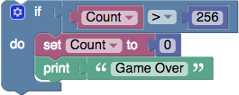

# How to Build MineTorch?

Our app uses Blockly to build components of a Deep Learning pipeline. Deep Learning is a very dynamic field. If the application changes, we need to build a new model.
Not all components for trending Deep Learning projects, are available in MineTorch. For such need, I will explain in detail how to build blocks in Blockly like we did to build MineTorch.

### What is Blockly?

Blockly is a library that adds a visual code editor to web and mobile apps. The Blockly editor uses interlocking - graphical blocks to represent code concepts like:
* Logical expressions
* Variables
* Loops

It allows users to apply programming principles, without having to write syntax or using the command line.

The below image shows a simple code with the condition

`count > 256` 

The program will set the count to zero and then print

`Game Over`

For more details check this [github](https://github.com/google/blockly) and [Project Page](https://developers.google.com/blockly/)

### Why Blockly?

We wanted an interface that allows adding components in a User Interface, in the form of blocks.
By combining blocks we can generate python code, and use it in a Deep Learning project.

We came across Blockly, which already has some build-in programming blocks. 
We realized we needed to build Custom High Level Blocks for Deep Learning. We started by going through this guide [Developer Guide](https://developers.google.com/blockly/guides/configure/web/custom-blocks) on how to build custom blocks in Blockly. 
  
### How to add Deep Learning Component?

I will explain steps to add a simple block. 

## References:
* https://github.com/google/blockly
* https://developers.google.com/blockly/
* https://developers.google.com/blockly/guides/configure/web/custom-blocks

