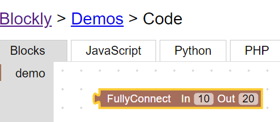

# How to Build MineTorch?

Our app uses Blockly to build components of a Deep Learning pipeline. Deep Learning is a very dynamic field. If the application changes, we need to build a new model.
Not all components for trending Deep Learning projects, are available in MineTorch. For such need, I will explain in detail how to build blocks in Blockly like we did to build MineTorch.

## What is Blockly?

Blockly is a library that adds a visual code editor to web and mobile apps. The Blockly editor uses interlocking - graphical blocks to represent code concepts like:
* Logical expressions
* Variables
* Loops

It allows users to apply programming principles, without having to write syntax or using the command line.

The below image shows a simple code with the condition:
`count > 256` 

The program will set the count to zero and then print:
`Game Over`


For more details check this [github](https://github.com/google/blockly) and [Project Page](https://developers.google.com/blockly/)

## Why Blockly?

We wanted an interface that allows adding components in a User Interface, in the form of blocks.
By combining blocks we can generate python code, and use it in a Deep Learning project.

We came across Blockly, which already has some build-in programming blocks. 

We realized we needed to build Custom High Level Blocks for Deep Learning. We started by going through this guide [Developer Guide](https://developers.google.com/blockly/guides/configure/web/custom-blocks) on how to build custom blocks in Blockly. 
  
## How we created a Dense Layer Block in MineTorch?

I will explain details about creating Dense layer Block which can create Dense Layer according to the Pytorch Model in Python. 

Our Goal is to create a Dense Layer Block which can take three input:
1. In: Input Dimension of Dense Layer
2. Out: Output Dimension of Dense Layer
3. Activation: Give user a choice to select activation function like `Relu`, `Tanh`, and `Softmax` 

### Step1. Clone Blockly Github Repository
```
git clone https://github.com/buoyancy99/MineTorch.git
```

### Step2. Create javascript files for backend code
We need to write three `demo.js` file in the below two location,
1. `blockly/blocks`
2. `blockly/generators/python`

### Step3. Write Backend function for Block
Our Goal is to create Dense Layer Block in `blockly/blocks/demo.js`
```javascript
Blockly.Blocks['nn_dense'] = {
  init: function() {
    this.appendDummyInput()
        .appendField("FullyConnect ")
        .appendField("In")
        .appendField(new Blockly.FieldNumber(0, 0, 1024, 1), "in")
        .appendField("Out")
        .appendField(new Blockly.FieldNumber(0, 0, 1024, 1), "out")
        .appendField("Activation")
        .appendField(new Blockly.FieldDropdown([[{"src":"https://i.ibb.co/NmgSYPW/relu-1.png","width":20,"height":20,"alt":"*"},"relu"], [{"src":"https://i.ibb.co/1dVp7VR/tanh.png","width":20,"height":20,"alt":"*"},"tanh"], [{"src":"https://i.ibb.co/zm27KLn/sigmoid-1.png","width":20,"height":20,"alt":"*"},"sigmoid"], ["none","None"]]), "activation");
    this.setInputsInline(true);
    this.setOutput(true, null);
    this.setColour(15);
 this.setTooltip("");
 this.setHelpUrl("");
  }
};
``` 
### Step4. Write Python Code Generator for Block
This code will help us to create python script in the UI. 

```javascript
'use strict';

goog.provide('Blockly.Python.nn');
goog.require('Blockly.Python');

Blockly.Python['nn_dense'] = function(block) {
  var number_in = block.getFieldValue('in');
  var number_out = block.getFieldValue('out');
  var dropdown_activation = block.getFieldValue('activation');
  // TODO: Assemble Python into code variable.
  var code = 'nn.Dense(' + number_in + ', '+ number_out + ')';
  // TODO: Change ORDER_NONE to the correct strength.
  return [code, Blockly.Python.ORDER_NONE];
};

```
This will generate pytorch Dense Layer according to the user input.

### Step5. Create HTML file for UI
we need to create an HTML file in the below folder. Lets say we are creating `demo.html` for UI Demo
`blockly/demos/code/demo.html`

### Step6. Write HTML Code
In the html file created in step.5 write UI Code code demo so that it can be tested easily,

The below code is will create a simple UI with Dense Folder 
```html
<!DOCTYPE html>
<html>
<head>
  <meta charset="utf-8">
  <meta name="google" value="notranslate">
  <title>Blockly Demo:</title>
  <link rel="stylesheet" href="style.css">
  <script src="/storage.js"></script>
  <script src="../../blockly_compressed.js"></script>
  <script src="../../blocks_compressed.js"></script>
  <script src="../../blocks/demo.js"></script>
  <script src="../../javascript_compressed.js"></script>
  <script src="../../python_compressed.js"></script>
  <script src="../../generators/python/demo.js"></script>
  <script src="code.js"></script>

</head>
<body>
  <table width="100%" height="100%">
    <tr>
      <td>
        <h1><a href="https://developers.google.com/blockly/">Blockly</a>&rlm; &gt;
          <a href="../index.html">Demos</a>&rlm; &gt;
          <span id="title">...</span>
        </h1>
      </td>
      <td class="farSide">
        <select id="languageMenu"></select>
      </td>
    </tr>
    <tr>
      <td colspan=2>
        <table width="100%">
          <tr id="tabRow" height="1em">
            <td id="tab_blocks" class="tabon">...</td>
            <td class="tabmin">&nbsp;</td>
            <td id="tab_javascript" class="taboff">JavaScript</td>
            <td class="tabmin">&nbsp;</td>
            <td id="tab_python" class="taboff">Python</td>
            <td class="tabmin">&nbsp;</td>
            <td id="tab_php" class="taboff">PHP</td>
            <td class="tabmin">&nbsp;</td>
            <td id="tab_lua" class="taboff">Lua</td>
            <td class="tabmin">&nbsp;</td>
            <td id="tab_dart" class="taboff">Dart</td>
            <td class="tabmin">&nbsp;</td>
            <td id="tab_xml" class="taboff">XML</td>
            <td class="tabmax">
              <button id="trashButton" class="notext" title="...">
                
              </button>
              <button id="linkButton" class="notext" title="...">
                
              </button>
              <button id="runButton" class="notext primary" title="...">
                
              </button>
            </td>
          </tr>
        </table>
      </td>
    </tr>
    <tr>
      <td height="99%" colspan=2 id="content_area">
      </td>
    </tr><pre id="content_python" class="content prettyprint lang-py"></pre>
  </table>
  <div id="content_blocks" class="content"></div>
  <pre id="content_javascript" class="content prettyprint lang-js"></pre>
  <pre id="content_python" class="content prettyprint lang-py"></pre>
  <pre id="content_php" class="content prettyprint lang-php"></pre>
  <pre id="content_lua" class="content prettyprint lang-lua"></pre>
  <pre id="content_dart" class="content prettyprint lang-dart"></pre>
  <textarea id="content_xml" class="content" wrap="off"></textarea>
  <xml xmlns="https://developers.google.com/blockly/xml" id="toolbox" style="display: none">
  <category name="demo" colour="#a5745b">
      <block type="nn_dense">
        <field name="in">0</field>
        <field name="out">0</field>
        <field name="activation">relu</field>
      </block>
  </category>
  </xml>
</body>
</html>
```

### Step7. Test HTML code in Browser
we can test the above created html file by opening it in the browser

The output will look like the below screenshot in the website


If we check the python code it will be like below code
```python
nn.Dense(0, 0)
```
## References:
* https://github.com/google/blockly
* https://developers.google.com/blockly/
* https://developers.google.com/blockly/guides/configure/web/custom-blocks


